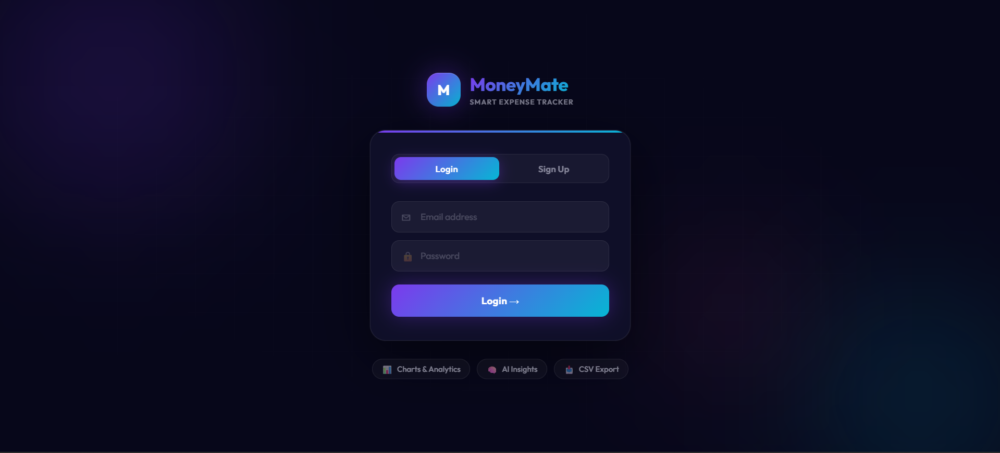
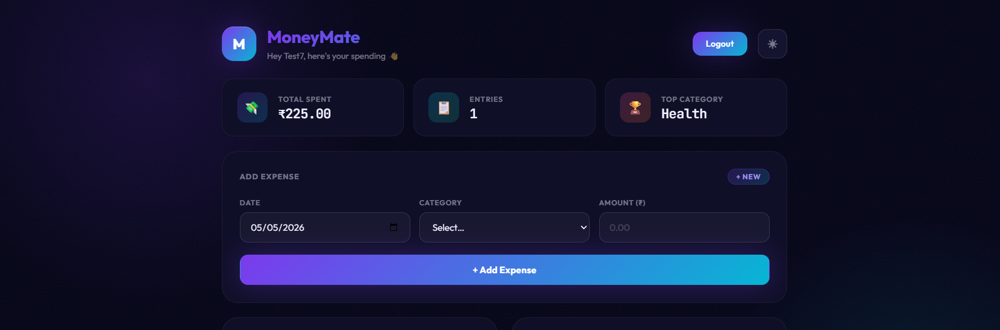
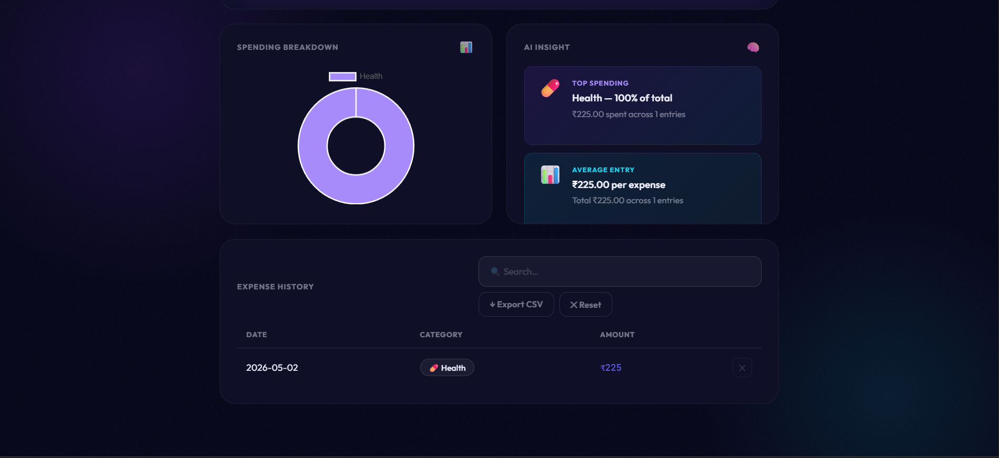
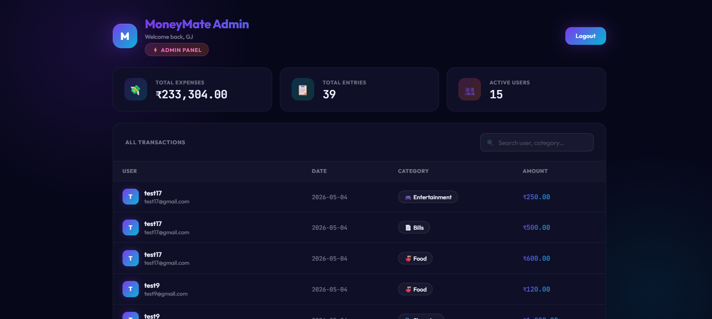
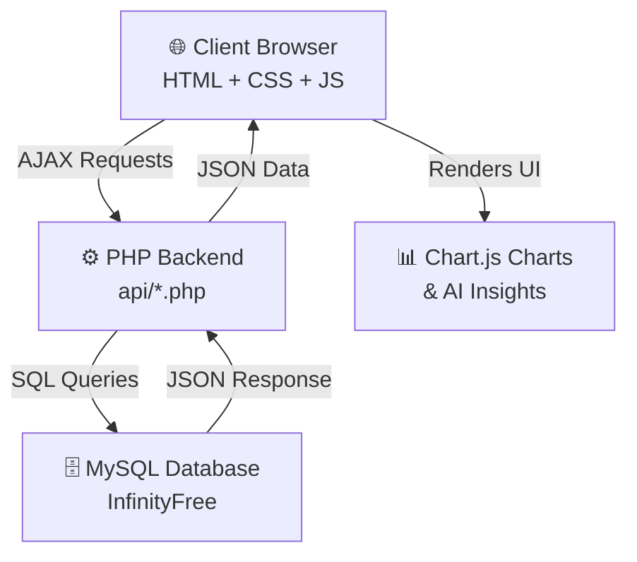
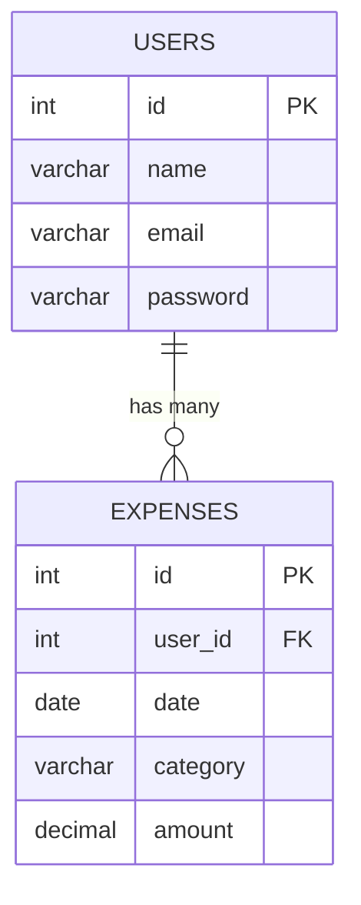
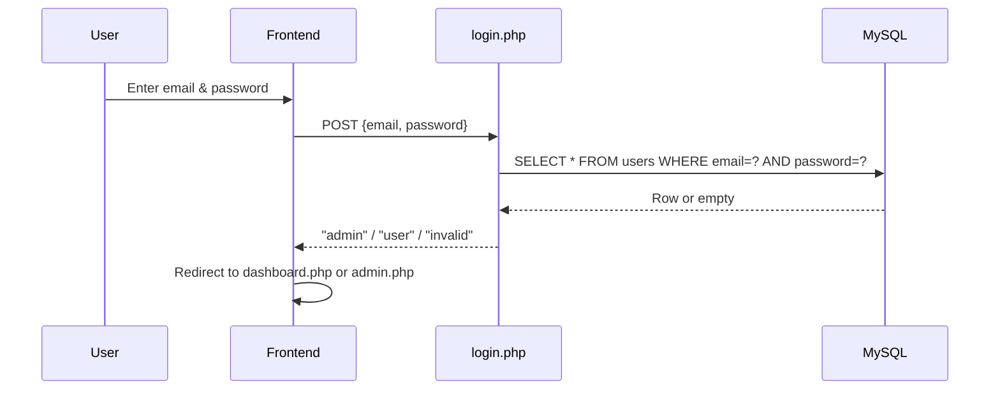
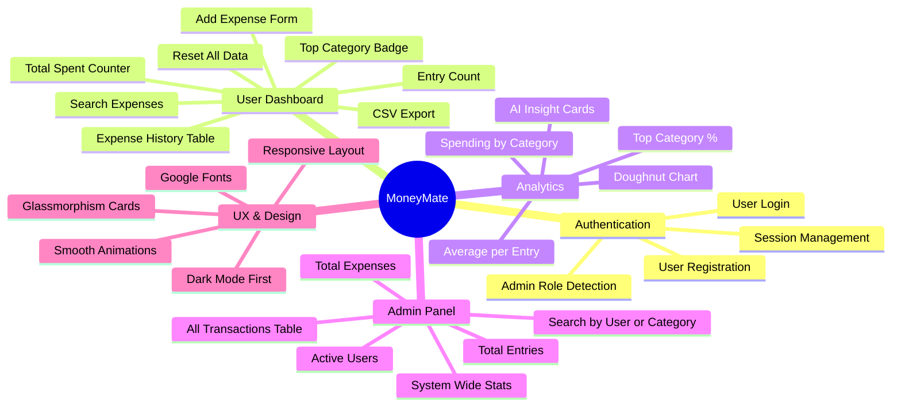
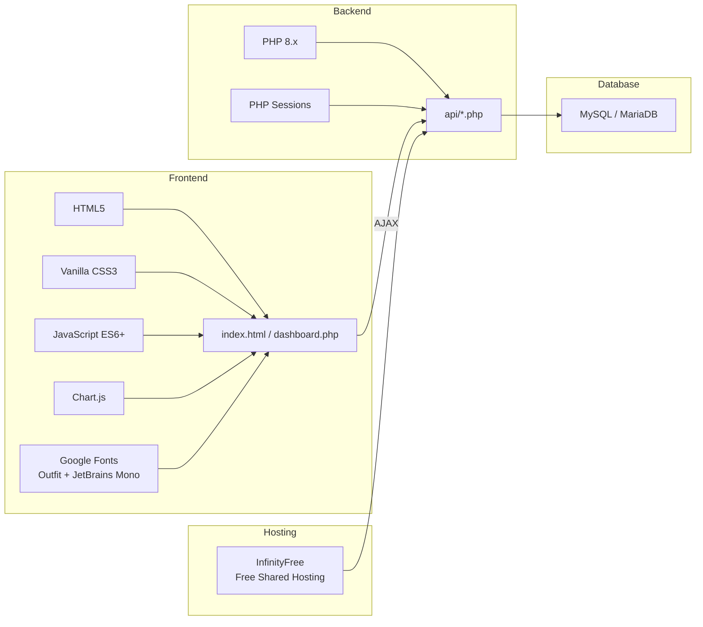
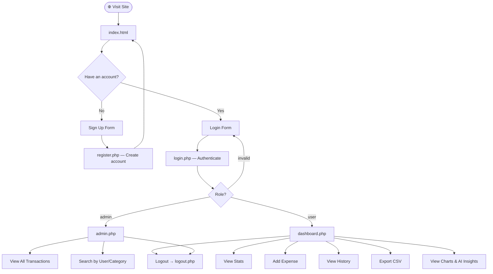

<div align="center">

# 💸 MoneyMate — Project Report
### Smart Expense Tracker Web Application

[](https://moneymate-smartexpensetracker.free.nf/)
[](https://github.com/Fikshan7/MoneyMate)
[](https://www.php.net/)
[](https://www.mysql.com/)

**Author: Garvit Jain** | [github.com/Fikshan7](https://github.com/Fikshan7)

---
*MoneyMate Project Report — github.com/Fikshan7/MoneyMate*

</div>

---

## 📋 Table of Contents

1. [Project Overview](#-1-project-overview)
2. [Live Demo](#-2-live-demo)
3. [Screenshots](#-3-screenshots)
4. [System Architecture](#-4-system-architecture)
5. [Database Design](#-5-database-design)
6. [API Reference](#-6-api-reference)
7. [Feature Breakdown](#-7-feature-breakdown)
8. [Tech Stack](#-8-tech-stack)
9. [User Flow Diagram](#-9-user-flow-diagram)
10. [Deployment](#-10-deployment)
11. [Security Considerations](#-11-security-considerations)
12. [Author](#-12-author)

---

<div align="right"><sub>MoneyMate Project Report — github.com/Fikshan7/MoneyMate</sub></div>

## 🧭 1. Project Overview

**MoneyMate** is a full-stack web application designed to give users complete visibility and control over their personal finances. Built with a focus on clean UI, real-time data, and AI-driven insights, it provides an intuitive platform for tracking daily expenses, viewing spending patterns, and making informed financial decisions.

### Core Objectives

| Objective | Description |
|-----------|-------------|
| 🎯 Simplicity | Frictionless expense entry and tracking |
| 📊 Visualisation | Interactive charts for spending breakdown |
| 🧠 Insights | AI-style analysis of spending behaviour |
| 🛡️ Admin Control | System-wide transaction monitoring |
| 🌐 Accessibility | Deployed online — accessible from any device |

---

<div align="right"><sub>MoneyMate Project Report — github.com/Fikshan7/MoneyMate</sub></div>

## 🌐 2. Live Demo

The application is deployed and accessible at:

> 🔗 **[https://moneymate-smartexpensetracker.free.nf/](https://moneymate-smartexpensetracker.free.nf/)**

**Hosting Platform**: InfinityFree (Free PHP & MySQL Shared Hosting)

---

<div align="right"><sub>MoneyMate Project Report — github.com/Fikshan7/MoneyMate</sub></div>

## 📸 3. Screenshots

### Login & Sign Up

The landing page provides a clean authentication interface. Users can switch between **Login** and **Sign Up** tabs seamlessly.



---

### User Dashboard

The dashboard greets the user by name and displays real-time stats — **Total Spent**, **Number of Entries**, and the **Top Spending Category**.



---

### Analytics & AI Insights

The analytics section shows a **doughnut chart** for spending breakdown by category and provides **AI-style insights** including top spending category and average expense per entry.



---

### Admin Panel

A dedicated admin view showing all users' transactions, system-wide totals, active user count, and a live searchable transaction table.



---

<div align="right"><sub>MoneyMate Project Report — github.com/Fikshan7/MoneyMate</sub></div>

## 🏗️ 4. System Architecture

MoneyMate follows a classic **3-Tier Architecture** pattern:



### Folder Structure

```text
MoneyMate/
├── api/                  # Backend REST-style PHP endpoints
│   ├── login.php         # User authentication
│   ├── register.php      # New user registration
│   ├── add_expense.php   # Insert new expense
│   ├── fetch_expense.php # Get expenses for current user
│   ├── delete_expense.php# Remove an expense entry
│   └── reset_expense.php # Clear all expenses for a user
├── assets/
│   ├── css/style.css     # Full design system (dark theme)
│   ├── js/script.js      # App logic, AJAX, Chart.js
│   └── img/              # Banner & screenshots
├── includes/
│   └── db.php            # MySQL database connection
├── docs/
│   └── PROJECT_REPORT.md # This document
├── index.html            # Landing & auth page
├── dashboard.php         # User dashboard (PHP session gated)
├── admin.php             # Admin panel (role gated)
└── logout.php            # Session destroy & redirect
```

---

<div align="right"><sub>MoneyMate Project Report — github.com/Fikshan7/MoneyMate</sub></div>

## 🗄️ 5. Database Design

MoneyMate uses **two core tables** in a MySQL/MariaDB database.

### Entity Relationship Diagram



### Table: `users`

| Column | Type | Description |
|--------|------|-------------|
| `id` | INT, AUTO_INCREMENT | Primary Key |
| `name` | VARCHAR(100) | User's display name |
| `email` | VARCHAR(150) | Unique login email |
| `password` | VARCHAR(255) | User password |

### Table: `expenses`

| Column | Type | Description |
|--------|------|-------------|
| `id` | INT, AUTO_INCREMENT | Primary Key |
| `user_id` | INT | Foreign Key → users.id |
| `date` | DATE | Date of the expense |
| `category` | VARCHAR(100) | Spending category |
| `amount` | DECIMAL(10,2) | Amount in INR (₹) |

---

<div align="right"><sub>MoneyMate Project Report — github.com/Fikshan7/MoneyMate</sub></div>

## 📡 6. API Reference

All endpoints live in the `api/` directory and are consumed via AJAX from the frontend.

| Endpoint | Method | Description | Auth Required |
|----------|--------|-------------|---------------|
| `api/login.php` | POST | Authenticates user, starts session | ❌ |
| `api/register.php` | POST | Creates a new user account | ❌ |
| `api/add_expense.php` | POST | Inserts a new expense record | ✅ Session |
| `api/fetch_expense.php` | GET | Returns all expenses for the session user | ✅ Session |
| `api/delete_expense.php` | POST | Deletes a specific expense by ID | ✅ Session |
| `api/reset_expense.php` | POST | Clears all expenses for the session user | ✅ Session |

### Login Flow



---

<div align="right"><sub>MoneyMate Project Report — github.com/Fikshan7/MoneyMate</sub></div>

## ✨ 7. Feature Breakdown



---

<div align="right"><sub>MoneyMate Project Report — github.com/Fikshan7/MoneyMate</sub></div>

## 🛠️ 8. Tech Stack



| Layer | Technology | Purpose |
|-------|-----------|---------|
| Markup | HTML5 | Page structure and semantics |
| Styling | Vanilla CSS3 | Custom dark design system |
| Logic | JavaScript (ES6+) | AJAX calls, DOM manipulation |
| Charts | Chart.js | Interactive doughnut charts |
| Backend | PHP 8.x | Server-side logic & session handling |
| Database | MySQL | Persistent data storage |
| Fonts | Google Fonts | Outfit & JetBrains Mono typography |
| Hosting | InfinityFree | Live online deployment |

---

<div align="right"><sub>MoneyMate Project Report — github.com/Fikshan7/MoneyMate</sub></div>

## 🔄 9. User Flow Diagram



---

<div align="right"><sub>MoneyMate Project Report — github.com/Fikshan7/MoneyMate</sub></div>

## 🚀 10. Deployment

### Platform: InfinityFree

| Property | Value |
|----------|-------|
| **Host** | InfinityFree |
| **Database Host** | sql100.infinityfree.com |
| **Database** | MySQL |
| **URL** | [moneymate-smartexpensetracker.free.nf](https://moneymate-smartexpensetracker.free.nf/) |

### Deployment Steps

1. **FTP Upload**: Files are uploaded via FileZilla to the InfinityFree `htdocs` directory.
2. **Database**: The MySQL database is created and managed via InfinityFree's phpMyAdmin panel.
3. **Configuration**: `includes/db.php` is updated with the InfinityFree credentials.
4. **Version Control**: Source code is maintained at [github.com/Fikshan7/MoneyMate](https://github.com/Fikshan7/MoneyMate).

---

<div align="right"><sub>MoneyMate Project Report — github.com/Fikshan7/MoneyMate</sub></div>

## 🔒 11. Security Considerations

| Concern | Current Status | Recommendation |
|---------|---------------|----------------|
| SQL Injection | ⚠️ Vulnerable (raw string interpolation) | Use prepared statements (`mysqli_prepare`) |
| Password Hashing | ⚠️ Plaintext passwords | Use `password_hash()` and `password_verify()` |
| Admin Access Control | ⚠️ Name-based check (`'GJ'`) | Use a role column in the `users` table |
| DB Credentials | ⚠️ Hardcoded in `db.php` | Use environment variables or a `.env` file |
| Session Hijacking | ✅ PHP sessions used | Regenerate session ID on login |

> These are known trade-offs made for rapid prototyping. Future versions will address all items above.

---

<div align="right"><sub>MoneyMate Project Report — github.com/Fikshan7/MoneyMate</sub></div>

## 👤 12. Author

<div align="center">

**Garvit Jain**

[](https://github.com/Fikshan7)
[](https://moneymate-smartexpensetracker.free.nf/)

---

*MoneyMate Project Report — github.com/Fikshan7/MoneyMate*

</div>
